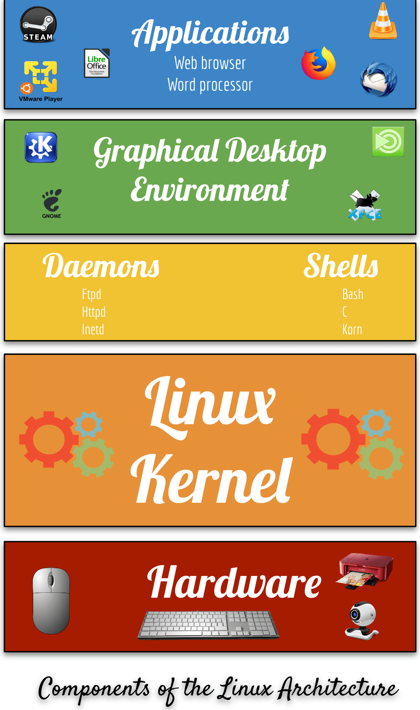

# Lecture 2 Introduction to Linux Notes

## Important concepts:
* **Operating System:** An operating system provides all the fundamental software features of a computer. An OS enables you to use the computer's hardware providing you the basic tools that make the computer useful. All of those features relay o the OS's kernel. Other OS features are owed to additional program that run atop the kernel. 
  
* **Kernel:** is a  software component that's responsible for managing low-level features of the computer, including the following managing system hardware, memory allocation, CPU time, and program to program interaction. 
  
* **Components of an operating system:**
  

* **Linux :** is a **Unix-like-Operating System** popular in academic and business environments. That is also call an open source operating system. 
  
* **Linux Characteristics:** 
    - Linux is open source software
    - Linux is available free of charge. 
    - Linux includes many of the Unix tools including many important internet server programs and programing language out of the box. 
    - Linux is highly scalable and customizable
    - Many businesses and nonprofit organizations rely on Linux for their day to day operations.
    - The vast majority of server applications on the internet run on some version of Linux
    - You can install Linux on almost any system as it support every processor architecture. 
  
* **GNU Toolchain:** is a collection of compilers, libraries, debuggers, and core utilities modeled on Unix, it's been ported to many Unix-like operating systems, and is used by default on GNU/Linux systems.
  
* **Linux Distribution:** is a complete Linux system package. 
  
* **What is Ubuntu:** ubuntu is a Linux distribution, freely available with both community and professional support.
The Ubuntu community is built on the ideas enshrined in the Ubuntu Manifesto:
    - The software should be available free of charge
    - the software tools should be usable by people in their local language and despite any stabilities. 
    - people should have the freedom to customize and alter 
    - their software in whatever way they see fit. 
  
* **Ubuntu Release cycles:** Ubuntu is shipped in stable and regular release cycles;
    * **Regular or non-LTS:** Shipped every six months and supported for 9 months. 
    * **LTS(Long-Term-Support):** Shipped every two even years and is supported for 5 years. 
    * Ubuntu is suitable for both desktop and server use. The current Ubuntu release supports: 
        - Intel x86 (IBM -compatible PC),
        - AMD64 (X86-64),
        - ARMv7,
        - ARMv8(ARM64),
        - IBM POWER8/POWER9(ppc64el),
        - IBM Z zEC12/zEC13/z14
        - IBM LinuxONE Rockhopper l+ll/Emporer l+ll(s390x).
  
* **What is Debian:** Debian is a all-volunteer organization dedicated to developing free software and promoting the ideals of the Free Software community. The Debian Project began in 1993, when lan Murdock compiled a group of developers to create a coherent linux distribution. 
  
* **Different software licensing models (open source vs closed source):**
  
| Open Source           | vs  | Closed Source                     |
| --------------------- | --- | --------------------------------- |
| The software may be   |     | The software isn't distributed    |
| distributed for a fee |     | with the source code. The         |
| or free. The source   |     | user is restricted from modifying |
| code is distributed   |     | the code                          |
| with the software.    |     |                                   |

* **The 4 Freedoms of Free Software:**
    1. use the software for any purpose
    2. examine the source code and modify it as you see fit
    3. redistribute the software
    4. redistribute your modified software

* **Virtualization:** is defined as creating virtual versions of something. 
* **Hypervisor and types:** There are 2 types of hypervisor 
    * **Type 1(bare-metal hypervisor)** runs directly on the hardware. The hypervisor is basically the operating system for the physical machine. Type 1 has better performance than Type 2, because there is no host OS involved and they system is dedicated to supporting virtualization. 
    * **Type 2** hypervisor its an application that runs on top of an operating system. This is most commonly used in client-side virtualization. Keep in mind that the host OS consumes resources and a host OS failure means tht the virtual machines will fail as well. 
  
* **VirtualBox:** is a powerful x86 and **AMD64/intel64** virtualization product for enterprise as well as home use. Not only is VirtualBox an extremely feature rich, high performance product for enterprise customers, it is also the only professional solution that is freely available as **Open Source Software** under the terms of the GNU General Public License (GPL) version 3. 

## List of the main Linux distributions
   * Debian 
   * Ubuntu 
   * Fedora
   * openSUSE
   * CentOS
   * Arch Linux
   * Linux Mint 
   * Gentoo
  
## List of some of the Debian Based Linux distributions
   * MX Linux
   * Linux Mint Debian Edition (LMDE)
   * Kali Linux 
   * Ubuntu
   * Deepin
   * Bodhi Linux 
   * Sparkly Linux 
  
## List of some of the Red Hat-based Linux distributions
   * Mageia
   * Fedora Linux 
   * Scientific Linux 
   * mandriva Linux 
   * EulerOS
  
## List of some of the Ubuntu Based Linux Distributions
   * Kubuntu
   * Lubuntu
   * Xubuntu
   * Ubuntu MATE
   * Pop! OS
   * Zorin OS
   * Linux Mint
