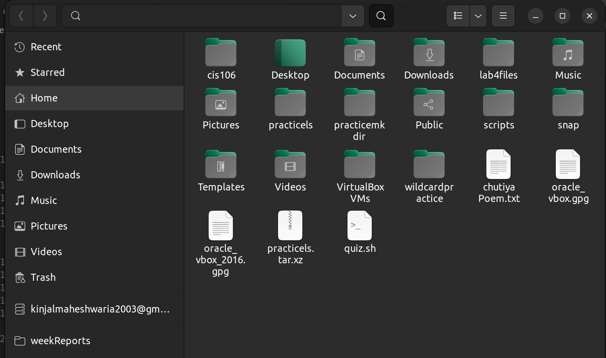

# File System

    The way files are stored and organized.

##### Usage

 > Linux uses the hierarchical directory structure (tree-like pattern of folders)

##### Formulas
You can navigate the filesystem through this commands 
* `ls` - to print the list of the current working directory
* `pwd` to see that where are you working
* `cd` to change files and go here and there in the file system 

##### Examples

# Pathname

    In a filesystem, every file has a pathname which indicates the location of the file in the filesystem

    * absolute
    * relative

##### Usage
 > Absolute - the location of a file starting the root of the file system. However, you can not jump around you need to be 100% sure that where is your desired file located and where exactly you wanna go. 
Relative- You can jump around through the file system from root to Downloads or Home

##### Examples
abosolute - /home/uchiha/Downloads/songs/songs.mp3
relative - Downloads/song.mp3

# Absolute path
    is a path that needs you to specify where exactly you want to move certain files or go. 

##### Usage

 > it requires the exact path where the file is located and you can navigate through that into the filesystem. 

##### Examples
/home/uchiha/Downloads/songs/songs.mp3
Downloads/songs/songs.mp3

# Relative path
    A relative path refers to a location that is relative to a current directory. Relative paths make use of two special symbols, a dot (.) and a double dot (..), which translate into the current directory and the parent directory.

##### Usage
A relative path is a way to specify the location of a file or directory in relation to the current working directory. It helps you navigate through the file system without providing the complete or absolute path.

##### Examples
Downloads/songs.mp3
Documents/test1.html
Documents/test2.py

# **your-home** & **the-home**
    one of the major difference beween your-home directory and the-home directory is every file system has a home directory by default which is called a home directory that is basically a file which named as a home. however, the home directory is your actual home when you enter the command cd which takes you to the the-home directory which is actually your home. like and partment of some streat which includes your home inside that apartment. 

##### Usage 
 > if you want to use relative path which jumps you from where ever you aer and summons you in your home directory which is your the-home directory from where you can see the entire building including your home. while using the absolute path or ../ when you are in the home directory which takes you to your home directory. 

##### Formulas

cd + destination 
ls + destination 

##### Examples
`cd$HOME`
`~cd`
`cd
`

# Parent directory
    The directory containing the current directory is called the parent directory, and the directory located within the current directory is called a subdirectory. Subdirectories branch off the root of the directory tree.

 
##### Usage
 > Also called a parent directory, it's the primary or top-level folder in a chain of subfolders. Parent folders organize files hierarchically — from the top-level parent down to the children files within — to make locating and managing related directories easy.

##### Examples
 >pwd
home/user
cd ../../..

and you will be in the root directory which is parent directory of all. 

# child directory
    Directory: A named group of files (a folder); a directory that contains more folders (subdirectories) are called the "parent" and the folder within it is referred to as the "child" of that directory..

##### Usage
> it's like a root of a branch it can expend however you want to in other words you can make as much as child directories you want to make yourself organized. 

##### Examples
/home/uchiha/Downloads/songs/songs.mp3
songs.mp3 is the child directory of songs and songs is a child directory of Downloads. 

# bash's special characters
    bash's special characters let's you do your work easier 

##### Usage
 > we uses the tab key for auto completion as well as arrow keys to repet the same commands and so on. 

##### Examples
`Tab` autocompletes a command by pressing the tab key
`arrow keys` allows you to move, ad repeat commands
`ctrl + a` go to the start of the command line 

##### Formulas 

ls + option + directory to list 

# environmental variables

    Environment variables, often referred to as ENVs, are dynamic values that wield significant influence over the behavior of programs and processes in the Linux operating system. These variables serve as a means to convey essential information to software and shape how they interact with the environment.

##### usage
 > Environment variables, often referred to as ENVs, are dynamic values that wield significant influence over the behavior of programs and processes in the Linux operating system. These variables serve as a means to convey essential information to software and shape how they interact with the environment.

##### formula 
command + Varibales in strings and no spaces
command + Integrers without strings and no spaces

 ##### examples
 USER - The currently logged-in user
 HOME - The home directory of the user 
 LOGNAME - the name of the user 

# user defined variables

    User-defined variables are fields which you define yourself in a program. They are used to store values or intermediate results obtained at some point in program processing for additional processing or display.

##### usage
 > Shells also allow you to create your own variables for use within scripts (local variables) and to pass between scripts (global variables). User variables are traditionally created using lower-case characters.

##### examples
name='bob'
age='30'
email='kinjal@gmail.com'

# Why do we need use $ with variables in bash shell scripting?
    You should put shell variables inside quotation marks to ensure that they are interpreted correctly by the shell. When you use a variable in a shell command or script without quotation marks, the shell will expand the variable, which means it will replace the variable with its value.Mar 25, 2023

##### usage
 > $ referring the variable's name. preceded by a dollar sign $

##### formula
$ + command (with no spaces)

##### example

$0
$USER
$HOSTNAME
